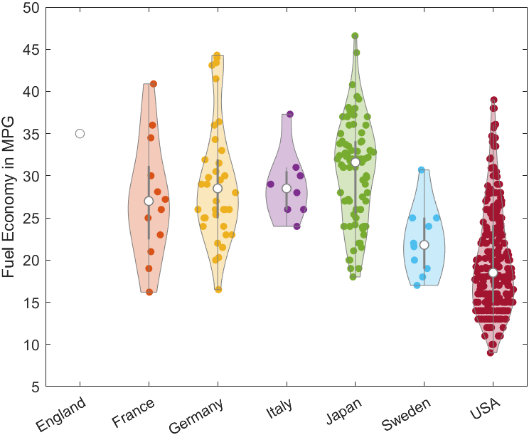

# Violin Plots for Matlab

A violin plot is an easy to read substitute for a box plot that
replaces the box shape with a kernel density estimate of the data, and
optionally overlays the data points itself. The original boxplot shape
is still included as a grey box/line in the center of the violin.

Violin plots are a superset of box plots, and give a much richer
understanding of the data distribution, while not taking more space.
You will be able to instantly spot too-sparse data, or multi-modal
distributions, which could go unnoticed in boxplots.

`violinplot` is meant as a direct substitute for `boxplot` (excluding
named arguments). Additional constructor parameters include the width
of the plot, the bandwidth of the kernel density estimation, and the
X-axis position of the violin plot.

For more information about violin plots, read "[Violin plots: a box
plot-density trace synergism](http://www.stat.cmu.edu/~rnugent/PCMI2016/papers/ViolinPlots.pdf)"
by J. L. Hintze and R. D. Nelson in The American Statistician, vol.
52, no. 2, pp. 181-184, 1998 (DOI: 10.2307/2685478).

```matlab
load carbig MPG Origin
Origin = cellstr(Origin);
figure
vs = violinplot(MPG, Origin);
ylabel('Fuel Economy in MPG');
xlim([0.5, 7.5]);
```



## Citation

[](https://zenodo.org/badge/latestdoi/60771923)

If you want to cite this repository, use 

> Bechtold, Bastian, 2016. Violin Plots for Matlab, Github Project  
> https://github.com/bastibe/Violinplot-Matlab, DOI: 10.5281/zenodo.4559847
